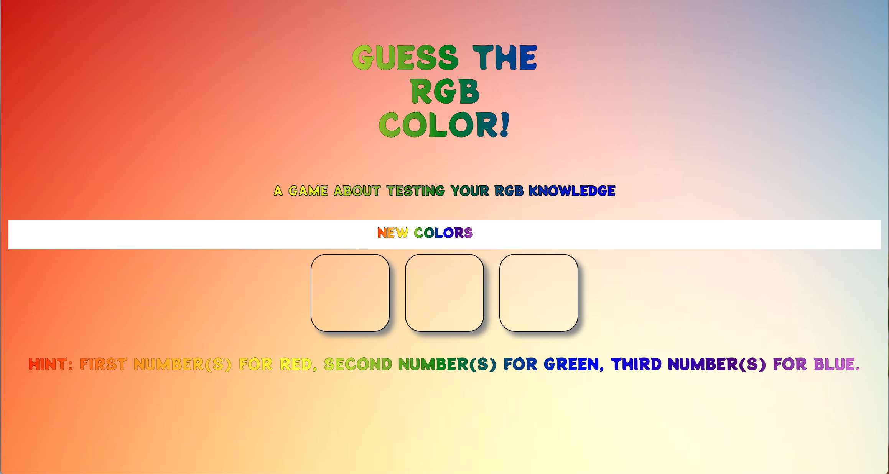
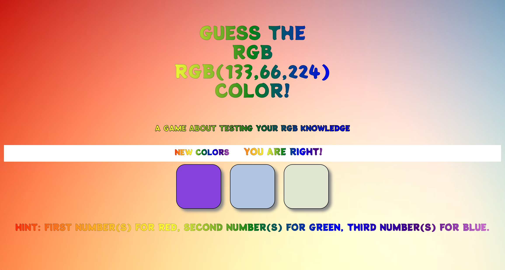
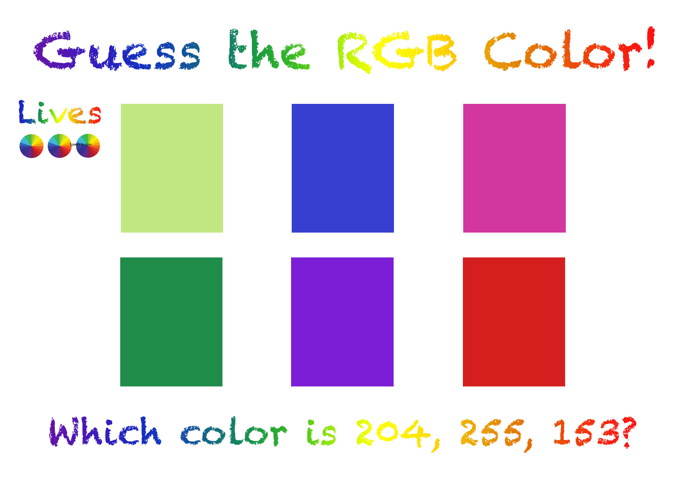
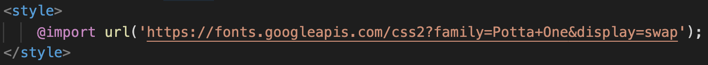
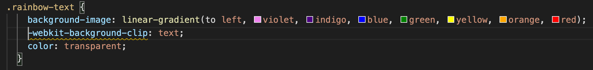
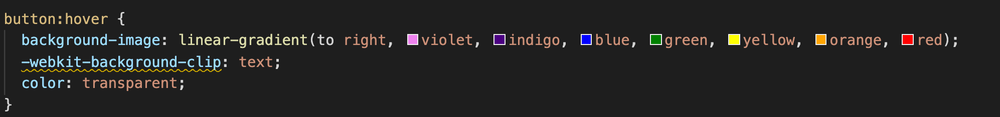
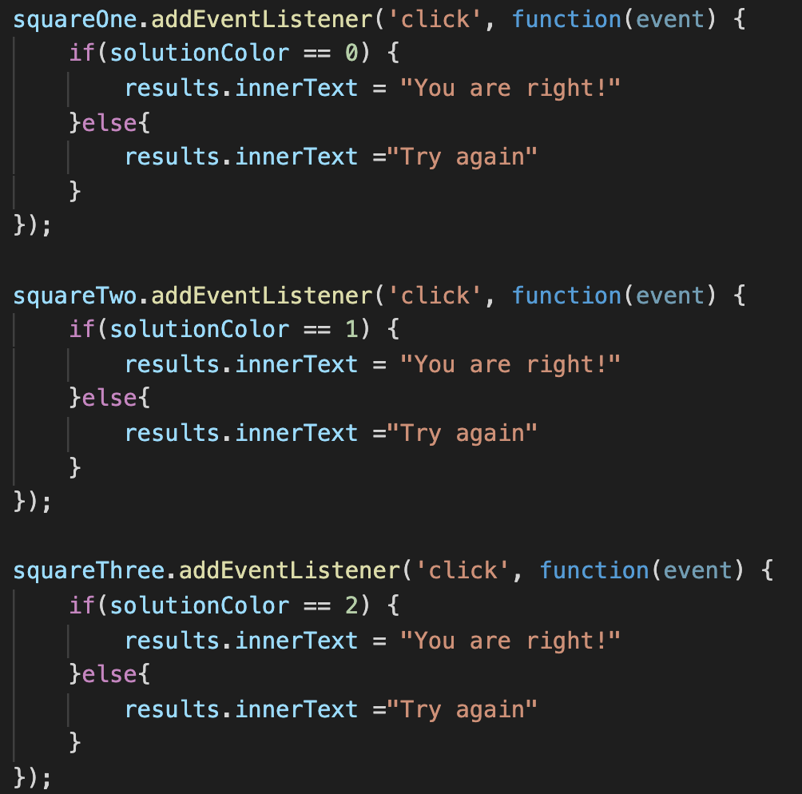

# Guess the RGB
This is an interactive game that tests the player's RGB knowledge. After clicking new colors, the RGB numbers will be displayed and 3 different colors will be shown in the boxes. The player will then have to decide which is the correct RGB.

### Motivation
What motivated me to make this game was that it seemed challenging enough to test my JavaScript knowledge. I was able to implement what I learned all while pushing me to learn new JavaScript techniques. 

---
### Screenshots

---
### User Stories & Wireframes
The planning materials used to build this app.
* High-level user stories.
1. Player hits 'New Colors' button
2. RGB numbers are displayed as well as 3 different colors in the boxes
3. Player has to guess which is the correct RGB color based on the RGB numbers being displayed
4. If player guesses correct, then 'You are right!' will be displayed
5. If player guesses incorrect, then 'Try Again' will de displayed.
6. When player presses 'New Colors' it will change the RGB value and the colors displayed in the boxes.

### Technologies & Code Snippets
* HTML, CSS & JavaScript
* 
* 
* 
* 

---
### Credits

James Sinkler

Nick Schmitt

Brian Krabec
---

### Future development
What are the next steps for the project? How will you continue to evolve it?

* In the future I would like to evolve it by adding an amount of guesses the player can make.
* I would also add a section that has lives and decreases with every incorrect guess
* Lastly, I would like to add 3 more boxes to the game to make the game a little more challenging.
